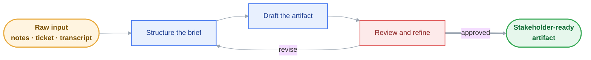
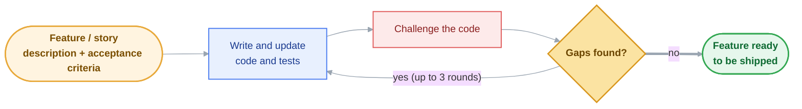

# skilldrop

A collection of portable **Claude Skills** you can drop into any IDE — for the deliverables knowledge workers actually ship: diagrams, design docs, ADRs, runbooks, decks, decision logs, comparison matrices, and exec summaries.

Originally scoped to solution architects, now broadly useful to PMs, founders, consultants, engineering leaders, exec assistants — anyone who turns ideas into stakeholder-ready artifacts.

Each skill is a plain directory of `SKILL.md` + supporting files + `manifest.json`. Works in **Claude Code** natively, and ports cleanly to **Cursor**, **Kiro**, **Continue**, **Cline**, **Aider**, and any other AI coding tool that accepts custom instructions or rules.

## How skilldrop works

skilldrop runs two value streams, and **nothing comes out of either until it passes a review gate.** Both diagrams render on GitHub; the Mermaid sources live in [`docs/`](docs/) for easy re-rendering.

### Knowledge-work pipeline

Raw input becomes a stakeholder-ready artifact — and loops back through review until it's approved.



### Code: implement and verify

A feature spec becomes shippable code through a self-correcting loop — generate, adversarially challenge, close the gaps, re-check — until the review is clean or a 3-round cap is hit. This is the [`feature-implement-loop`](skills/feature-implement-loop/SKILL.md) skill.



## Skills in this repo

### Pipeline glue

| Skill | What it does |
|---|---|
| [`brief-intake`](skills/brief-intake/SKILL.md) | Upstream collector. Takes raw mess — a Slack thread, meeting transcript, ticket, email chain, paragraph of notes — and emits a structured brief shaped for whichever downstream skill comes next (ADR, design doc, runbook, exec summary, deck, comparison matrix, decision log). Every field is tagged `[explicit] / [implied] / [inferred] / [missing]` with verbatim quotes from the source. |
| [`doc-critique`](skills/doc-critique/SKILL.md) | Counterpart reviewer. Takes an existing doc (ADR, design doc, runbook, exec summary, comparison matrix, deck, decision log) and produces a structured critique against the same rubrics the generators enforce — verdict + severity-tagged findings (blocker / major / minor / nit) with quoted evidence and concrete fixes, plus a "what's working" section. |

### Planning & delivery

Skills for the SDLC steps around the code itself — turning raw requirements into shippable, testable units of work and tracking them to release. (`feature-implement-loop` under Dev workflow is the natural downstream of these.)

| Skill | What it does |
|---|---|
| [`capacity-cost-model`](skills/capacity-cost-model/SKILL.md) | Build a capacity and cost model for a service or feature — sized from a **demand driver and its growth curve**, never from a chosen instance count. Everything expressed as **unit economics** (cost per request / tenant / GB, so it projects and optimizes); peak-vs-average and headroom written as explicit money-vs-incident decisions; cost at **1×/3×/10× with the scaling cliffs named** (tier jumps, cross-AZ egress, single-node→sharded) instead of a linear extrapolation that hides them; the **forgotten line items** checklisted (egress, observability ingestion, backups×retention×copies, non-prod, always-on NAT/LB) because their absence is what makes a model land 40% low; cost-drivers ranked; ranges not false precision; and a unit-cost-at-scale check that flags rising per-unit cost as an architecture problem. |
| [`business-case`](skills/business-case/SKILL.md) | Business case for a build/buy/defer investment decision, written so a sponsor can approve, challenge, or kill it on its merits. **Option 0 (do nothing) always present and costed**; every benefit is a re-runnable calculation with sourced inputs and a confidence tag (adjective benefits don't survive); all three cost layers per option — build, run (the year-2+ layer where cases go to die), and opportunity with the displaced work named; **ranges instead of false precision** ("327% ROI" from three guesses fails the doc); the **flip-assumption** identified with a de-risking step when confidence is low; a singular committal recommendation that states the runner-up's best argument fairly; and the ask in the first 40 words. |
| [`requirements-interview`](skills/requirements-interview/SKILL.md) | Per-stakeholder interview kits for feature discovery — sponsor, end users, ops/support, security/legal, finance — built only for stakeholders holding *open* unknowns. ≤7 questions per kit ranked by design impact, each annotated with the decision it informs and how the answer moves the design; problems-and-the-past phrasing only ("the last time", never "would you use…"); a mandatory **kill-question** per script with what a kill-answer looks like; and an assumptions-to-validate ledger where every assumption has a falsification condition (or gets flagged as needing data/prototype instead). Notes flow to `brief-intake` → `prd-draft`. |
| [`prd-draft`](skills/prd-draft/SKILL.md) | Draft a Product Requirements Document from a feature idea or `brief-intake` output — the missing link before design starts. Problem statement with **zero solution nouns** (tested: could it justify a different solution than the one in everyone's head?), personas specific enough to find one, a measurable "we'll know it worked when" line per goal, testable MoSCoW-prioritized requirements with a mandatory Won't-have list, **minimum 3 non-goals** (the scope-creep firewall), open questions with owners and dates, and every claim tagged `[reported by …]` / `[data: …]` / `[assumption]`. Sized for a 30-minute read; hands off to `user-story-splitter`, `nfr-spec`, `success-metrics`, and `design-doc`. |
| [`nfr-spec`](skills/nfr-spec/SKILL.md) | Sweep a feature through the full non-functional-requirements catalog — performance, throughput, availability/SLO, durability/DR, privacy/retention, accessibility, i18n, observability, operability, compatibility, cost. Every category lands in exactly one of three states: measurable target with a verification method, explicit n/a with a reason, or archetype default tagged `[assumption]` — silence is forbidden, and the output ledger proves the sweep happened. Targets are calibrated by system archetype and the "what happens if it's down for an hour" answer (anti-five-nines-cargo-cult); retention/deletion is first-class per data class; observability is written as 3am questions, not tool names. Feeds `design-doc`, `test-plan-generator`, and `threat-model`. |
| [`success-metrics`](skills/success-metrics/SKILL.md) | Define how a feature's success will be measured *before* it's built. Exactly one primary metric — an outcome, not an output or vanity count — with baseline, target, and timeframe (no baseline? measuring it becomes milestone 1); leading indicators for steering; guardrails with current values and alert thresholds; a **counter-metric** naming how the primary could be gamed and what catches it; an instrumentation plan where every metric maps to a named event marked exists/must-build (must-build = launch blocker, not fast-follow); and a **pre-committed, action-shaped decision rule** so a missed target triggers an agreed action instead of a "directionally positive" debate. |
| [`user-story-splitter`](skills/user-story-splitter/SKILL.md) | Split an epic, feature request, or PRD chunk into independently shippable vertical-slice user stories — SPIDR slicing patterns, walking-skeleton-first build order, 3–7 Gherkin acceptance criteria per story (always including an edge case), tagged `[assumption]`s, and an explicit "out of scope / not covered" ledger so nothing silently disappears. Each emitted story is shaped to hand straight to `feature-implement-loop`. |
| [`test-plan-generator`](skills/test-plan-generator/SKILL.md) | Generate a risk-based test plan for a feature, PR, or release. Risks ranked likelihood × impact before any test case is written (effort tracks priority); each case pushed to the lowest pyramid level that catches the failure (unit > integration > e2e, with e2e placement justified); every acceptance criterion mapped in a coverage table; edge-case taxonomy sweep (boundaries, idempotency, concurrency, dependency failure, timezones, …); observable entry/exit criteria; and a mandatory "Not tested — accepted risks" section. Takes `user-story-splitter` output, a diff/PR, or a prose brief. |
| [`release-notes`](skills/release-notes/SKILL.md) | Turn git history between two refs (default: last tag → HEAD) into two artifacts: customer-facing release notes rewritten in reader benefits — no commit-speak, no ticket IDs, no "various improvements" — and an internal Keep-a-Changelog version with a commit hash on every line. Breaking changes hoisted to the top of both with an "Action required" line (detected via `!:` markers, removed public API, migration files, major bumps); internal noise (refactors, CI, deps) never leaks into customer notes; vague commits land in a "Needs review" list instead of being guessed at. |
| [`bug-triage`](skills/bug-triage/SKILL.md) | Turn a vague bug report ("it's broken on mobile sometimes") into a ticket an engineer can start without contacting the reporter: searchable symptom-plus-condition title, numbered repro steps from a clean state (or an explicit "no repro yet" with the exact diagnostics to collect), expected-vs-actual with the verbatim error string, every claim tagged `[reported]` / `[verified]` / `[assumption]`, severity and priority judged independently (S4/P1 is a legitimate combination), ≤3 hypotheses each with a 5-minute check, and duplicate-search hints. One bug per ticket — multi-symptom reports get split. |
| [`migration-plan`](skills/migration-plan/SKILL.md) | Phased migration/rollout plan (schema change with live backfill, API version, datastore/auth/platform swap) built on the parallel-change pattern: expand → migrate → contract. One change per phase (a failed phase implicates exactly one thing); every phase carries an observable gate with bake time, a tested rollback with an explicit data story, and a blast radius; at most one **named point of no return**; backfill specified idempotent + resumable + rate-limited with 3-depth parity checks; dual-write requires a named reconciler; the contract phase gets a date and an owner so "we'll remove the old path later" actually happens. |

### Product strategy

Skills for the direction-setting layer above any single feature — testing whether a product idea deserves a team, analyzing a market position, and turning strategy into aligned goals. (`business-case` under Planning & delivery is the natural costed follow-on.)

| Skill | What it does |
|---|---|
| [`prfaq`](skills/prfaq/SKILL.md) | Write an Amazon-style PR/FAQ — the launch press release for a product that doesn't exist yet, plus customer and internal FAQs that force the hard questions before engineering starts. Problem stated in the customer's words (no jargon-laundering); solution names a **mechanism**, not a category; an **adoption hypothesis** with a behavioral first-success event (never "ships to beta" — that's the team's action, not the customer's); at least one customer-FAQ answer concedes a real trade-off; the internal FAQ names the riskiest assumption, a concrete acquisition path, a success metric that counts the first-success event, and a **kill condition**. Zero spec content — hands off to `prd-draft` or `business-case` if the idea survives. |
| [`strategy-analysis`](skills/strategy-analysis/SKILL.md) | Run a strategy framework — SWOT/TOWS, Porter's Five Forces, or PESTLE — chosen to fit the question, not the request (a "SWOT" that's really "should we enter this market" gets Five Forces suggested). Every cell must be **specific, evidence-tagged, and carry a so-what** — horoscope cells ("strong team") are banned; SWOT never ships without TOWS crossings; every Five Forces rating names the mechanism (who holds the power and why). Ends with **ranked, action-shaped implications** tied to a named decision and a verdict that takes a side and states what would change it. |
| [`okr-cascade`](skills/okr-cascade/SKILL.md) | Cascade company OKRs to team level with the two things cascades usually hide: a **ranked gap registry** (objectives no team credibly owns) and a **causal metric tree** (Mermaid) connecting every team KR to the north-star via a written causal sentence. Output KRs flagged at intake ("launch v2" → what outcome does it serve?); every team KR scorable 0.0–1.0 and measurable at the team's own scope; no alignment theater (teams with no credible contribution to an objective simply don't appear under it); company OKRs kept verbatim so the roll-up stays honest. Org-level counterpart to `success-metrics`, which takes each team KR into full feature-level measurement design. |

### Dev workflow

| Skill | What it does |
|---|---|
| [`feature-implement-loop`](skills/feature-implement-loop/SKILL.md) | Implement a feature/story so it ends up *verified*, not just generated. Takes a description + acceptance criteria, writes code and tests, then runs an adversarial review pass (delegating to the `devils-advocate` subagent where available, sweeping the four lenses inline elsewhere) to find gaps — broken edge cases, baked-in assumptions, acceptance criteria with no asserting test — and re-generates to close them. Loops until the review is clean or a hard 3-round cap is hit, then reports status (`VERIFIED` / `VERIFIED WITH OPEN ITEMS` / `BLOCKED`), an acceptance-criteria coverage table, and a per-round log. The build-cycle counterpart to the artifact pipeline. |
| [`devils-advocate`](skills/devils-advocate/SKILL.md) | Adversarial review of *just-generated* code, run right after an agent (or human) declares a feature done. Sweeps four lenses — edge cases the first pass missed, assumptions baked in that won't survive 6 months, what a staff engineer would push back on in review (concurrency, error handling, security, observability, blast radius), and test-coverage gaps. Produces severity-tagged findings (blocker / major / minor / nit) with file:line evidence, reproducible scenarios, and concrete fixes — plus a "what's solid" section. The code counterpart to `doc-critique`. |
| [`council-review`](skills/council-review/SKILL.md) | The "Claude Council." Convenes five distinct senior-engineer personas — 🏛 Architect, 🔒 Security, 🛠 Operator/SRE, ⚖️ Pragmatist, 👤 User-Advocate (plus optional bench seats: Performance, Cost, Data & Migration, Accessibility, Compliance) — to deliberate a decision, design, or code change. Each seat takes an independent stance (🟢 support / 🟡 conditions / 🔴 oppose / ⚪ abstain) with evidence; the genuine disagreements surface as named **cruxes**; a **Chair** issues a reconciled verdict (PROCEED / WITH CONDITIONS / REVISE / RECONSIDER / SPLIT) that names the tradeoff chosen, records dissent, and states what would change the decision. Where `devils-advocate` is one voice, the council is many that can disagree. Use for architecture decisions, risky changes before merge, RFC scrutiny, "should we adopt X?", or a pre-mortem. |
| [`threat-model`](skills/threat-model/SKILL.md) | STRIDE threat model from a design doc, architecture description, or `reverse-architecture` output — *before* the code exists. Establishes assets / entry points / trust boundaries first, runs STRIDE per boundary crossing, and writes every threat as a concrete actor → path → result scenario (severity 🟥/🟧/🟨/⚪ calibrated to *this* system's assets, not CVSS theater). Credits existing mitigations as verified-vs-assumed, attaches a verification step to every recommendation, and forces the two classic blind-spot sweeps: authz (tenant→tenant, authn ≠ authz) and insider/compromised-credential. Design-phase counterpart to `devils-advocate`. |
| [`accessibility-audit`](skills/accessibility-audit/SKILL.md) | Adversarial WCAG 2.2 AA audit of a UI — component code, page markup, screenshot, or a described flow. The UI counterpart to `devils-advocate`: every finding cites a **specific success criterion** (number + name + level), names the **user group and assistive tech it blocks** (no victim, no finding), is severity-tagged by task-completion impact (🟥 blocker → ⚪ nit), and carries a concrete fix. Computes real contrast ratios (not eyeballing), sweeps the high-yield checks scanners miss (focus order, name/role/value, alt-text *quality*, error recovery, reflow, target size), tags each finding `[auto]` vs `[manual]` so CI-gateable issues are split from the human-only ones, and states the input's coverage limits — a screenshot audit never claims keyboard operability passes. Ships the WCAG catalog and a worked example. |
| [`sonar-onboard`](skills/sonar-onboard/SKILL.md) | One-shot scaffold to make a repo Sonar-compliant. Supports both **SonarQube server** (self-hosted) and **SonarCloud** (SaaS) — user picks at setup. Emits `sonar-project.properties` with language-detected source/test/coverage paths, a GitHub Actions workflow that runs the scanner on push + PR and blocks merge on quality-gate failure, and a README snippet documenting the gate. |
| [`sonar-review`](skills/sonar-review/SKILL.md) | Per-change Sonar compliance review. Runs the scanner against the current branch, fetches the quality-gate verdict + issues + security hotspots from the Sonar API, and produces a structured markdown report scoped to changed files: gate PASS/FAIL on top, then severity-tagged findings (🟥 blocker / 🟧 critical / 🟨 major / ⚪ minor) grouped into five lenses (bugs, vulnerabilities, security hotspots, code smells, coverage + duplication), each with file:line, the Sonar rule ID, why it matters, and a concrete fix. Auto-detects server vs cloud from `sonar-project.properties`. Sister skill to `devils-advocate`. |

### Diagrams

| Skill | What it does |
|---|---|
| [`architecture-diagrams`](skills/architecture-diagrams/SKILL.md) | Turn a written description of a system into a renderable Mermaid, PlantUML, or C4 diagram. Supports AWS / Azure / GCP cloud shapes, sequence flows, container diagrams, and ER models. |
| [`reverse-architecture`](skills/reverse-architecture/SKILL.md) | Reverse-engineer a system's "as-is" architecture from existing code, IaC (Terraform / CloudFormation / CDK / Pulumi / Bicep), Kubernetes manifests, docker-compose, package manifests, database schema, or OpenAPI. Emits a structured node/edge extraction, a written description suitable for `architecture-diagrams`, and a first-draft Mermaid / C4 diagram with every node tied to a source-of-truth file path. |
| [`figma-diagrams`](skills/figma-diagrams/SKILL.md) | Read structure from existing Figma/FigJam files and produce FigJam-importable diagram specs (and comments) via the Figma REST API. Useful when your final deliverable lives in Figma. |
| [`user-journey-map`](skills/user-journey-map/SKILL.md) | Map one persona's end-to-end journey toward one outcome — 3–6 goal-phase stages (never one-per-screen), each with actions / reasoned emotion scores / pains / **outcome-shaped opportunities** (no solutioning — "add SSO" belongs downstream), rendered as a Mermaid `journey` emotion arc. Declares its **evidence level** up front (`[observational]` / `[survey/analytics]` / `[assumption-based]`) so a hypothesis never masquerades as research; marks the steepest dips, the peak, and the *ending* emotion (peak-end rule); and ranks opportunities down to **1–2 named improvement targets** instead of an unranked pain inventory. Hands committed targets to `prd-draft` / `user-story-splitter` and measurement to `success-metrics`. |

### Documentation

| Skill | What it does |
|---|---|
| [`adr-generator`](skills/adr-generator/SKILL.md) | Generate an Architecture Decision Record in MADR or Nygard format from a context-decision-consequences brief, with sensible numbering and filename. |
| [`design-doc`](skills/design-doc/SKILL.md) | Generate a Google-style engineering design doc (problem → goals/non-goals → alternatives → proposal → risks → rollout) from a feature brief. |
| [`runbook-generator`](skills/runbook-generator/SKILL.md) | Generate an operational runbook for a service — deploy/rollback, top 5 incident playbooks, SLOs, on-call escalation, dependencies. |
| [`observability-plan`](skills/observability-plan/SKILL.md) | Design the telemetry that makes a service detectable-before-users-complain and debuggable-at-3am. SLIs defined from **user journeys** (good/valid events), not resource graphs — latency SLIs as threshold counts at a percentile, never averages; SLOs with an **error budget in human terms and a spend policy** (what freezes when it's gone); **symptom-based, multi-window burn-rate alerting** where a page means a human must act now and every page is runbook-linked (the alert-fatigue fix); the three pillars split by purpose (metrics for SLOs/alerts with bounded cardinality, structured sampled logs for debugging, tail-sampled traces for cross-service attribution); and a **cardinality + cost budget** so observability doesn't become the surprise invoice. Expands `nfr-spec`'s observability row; feeds `runbook-generator`, `incident-comms`, `postmortem-generator`. |
| [`postmortem-generator`](skills/postmortem-generator/SKILL.md) | Generate a blameless incident postmortem from raw response material (Slack scrollback, pager timeline, notes). Quantified impact table (numbers or `[missing]` — never "significant impact"); UTC timeline with computed detection and mitigation gaps; 2+ contributing factors with "human error" structurally banned; mandatory what-went-well / poorly / **where-we-got-lucky** lists; ≤8 action items each with owner role, prevent/detect/mitigate class, and a verifiable done-condition; ends with paste-ready runbook deltas for `runbook-generator`. |
| [`guide-builder`](skills/guide-builder/SKILL.md) | Turn raw notes or a spec into an easy-to-follow guide, auto-styled to the content: a setup/quickstart (prerequisites → steps → verify → troubleshooting), a design walkthrough (mental model → flow → key decisions → where the code lives), or an API/event-schema reference (typed contracts + example payloads + error catalog). Distinct from `runbook-generator` (SRE/on-call) and `design-doc` (proposal for review). |
| [`api-contract-draft`](skills/api-contract-draft/SKILL.md) | Draft an OpenAPI 3.1 contract from a feature brief, *before* the code — resource-oriented paths (plural nouns, no RPC verbs), full RFC 9457 error catalog with machine-readable codes per operation, cursor pagination / `Idempotency-Key` / URL versioning decided at draft time instead of retrofitted, production-realistic examples on every operation, and typing rules that ban the classic regrets (float money, naked timestamps, unbounded strings). Emits a **decisions log** alongside the YAML so reviewers argue choices, not line numbers. Handles event/webhook contracts (AsyncAPI-shaped) with the same rigor. Designing new contracts only — documenting an existing API is `guide-builder`'s job. |
| [`db-schema-design`](skills/db-schema-design/SKILL.md) | Design a database schema **from the queries backward** — the access patterns (frequency, selectivity, consistency) come before any table is drawn. Paradigm chosen with a reason tied to those patterns (relational is the default and needs none; every move past it justifies itself); keys designed from queries (surrogate PK by default, NoSQL partition+sort key to avoid hot partitions, no random UUIDv4 as a clustered key); 3NF then denormalize only for a named hot read *with* its sync obligation; indexes mapped one-to-one to real queries (composite order = equality→range→sort); money/time/enum types right at the schema; explicit multitenancy and unbounded-growth-table decisions; and a **verification table proving every access pattern has a supporting path**, full scans flagged. Distinct from `data-contract` (published-dataset guarantee) and `api-contract-draft` (sync interface); hands evolution to `migration-plan`. |
| [`data-contract`](skills/data-contract/SKILL.md) | Draft a data contract for a dataset, table, or event stream others depend on — the data-engineering counterpart to `api-contract-draft`. Schema specified with **per-field semantics and units** (the cents-vs-dollars, UTC-vs-local, gross-vs-net firewall), measurable quality SLAs across freshness / completeness / validity / uniqueness / distribution — each with a threshold, a check, and a **breach action** — a schema-evolution policy that names the silent killer (changing a field's *meaning* under a stable name/type is breaking, and no validator catches it), enumerated consumers (so "breaking" is defined and notices have an address), a named owner, and per-field PII classification. Marks aspirational-vs-met SLAs honestly on existing assets. |
| [`tech-comparison-matrix`](skills/tech-comparison-matrix/SKILL.md) | Produce a weighted comparison matrix for a tech-selection question (e.g. "Postgres vs DynamoDB") with criteria, weights, scores, and a recommendation. |

### AI adoption & observability

| Skill | What it does |
|---|---|
| [`ai-usage-report`](skills/ai-usage-report/SKILL.md) | Turn a CSV/JSONL of AI usage events (exported from an MCP server or other telemetry source) into a per-user, team-rollup, or effectiveness-focused report. Surfaces volume, breadth, session depth, and — where the data supports it — whether AI outputs were actually consumed in shipped artifacts vs generated and discarded (the "AI theater" question). Refuses to generate an aggregate rollup for teams smaller than 5 to preserve anonymity. |
| [`llm-eval-harness`](skills/llm-eval-harness/SKILL.md) | Design the **dev-loop quality gate** for an LLM-powered feature (prompt, RAG, agent, classifier) — so prompt and model changes ship on numbers, not vibes. A versioned golden set in three deliberate buckets (representative from real logs, adversarial/edge, and regression cases frozen from every past failure); the **cheapest adequate grading method per case** (programmatic → structured assertions → LLM-as-judge only when quality is genuinely subjective, and then validated against human labels with bias controls); a metric matched to the task with **both gates set before the first run** (no-regression + critical-subset-at-100%); a failure taxonomy that points iteration at the biggest bucket; and cost/latency tracked beside quality. Enforces the held-out split and the no-tuning-on-test rule. Provider-neutral. |

### Stakeholder communication

| Skill | What it does |
|---|---|
| [`audience-profile`](skills/audience-profile/SKILL.md) | Translate an audience type (exec, board, technical, sales, investor, internal, partner, customer) into structural rules — slide count, density, tone, must-have sections. Reusable input for the next three skills. |
| [`slide-outliner`](skills/slide-outliner/SKILL.md) | Outline an architecture-review or pitch deck — slide titles, key points, and speaker notes — sized to a target time budget. Doesn't generate PPTX. |
| [`deck-builder`](skills/deck-builder/SKILL.md) | Generate a real PowerPoint (`.pptx`) file from content + audience + color palette. Uses `python-pptx`; supports 7 layout types and audience-tuned density. Pairs naturally with `audience-profile` + `slide-outliner`. |
| [`exec-summary`](skills/exec-summary/SKILL.md) | Compress a long technical document into a one-page executive summary structured around an Ask, business impact, cost/timeline, risks, and what you need from the audience. |
| [`decision-log`](skills/decision-log/SKILL.md) | Extract decisions, action items, owners, and due dates from meeting notes, Slack threads, or transcripts into a structured log with source attribution. |
| [`incident-comms`](skills/incident-comms/SKILL.md) | Draft the messages you send *while an incident is still burning* — audience-segmented into customer status-page posts, internal stakeholder updates that arm the relayer, and three-sentence exec briefs (business impact + the ask). Every message leads with reader-facing impact (not internal symptom), uses the precise status vocabulary (investigating / identified / monitoring / resolved), commits only to the **next-update time** (never a fix ETA or speculative cause you'd have to retract), and stays blameless and screenshot-safe. Acknowledge → update-on-committed-cadence → verified resolve. Completes the operate triad with `runbook-generator` (how to fix) and `postmortem-generator` (what to say after). |

## What's in a skill

Every skill folder follows the same layout, so installation is the same anywhere:

```
skills/<skill-name>/
├── SKILL.md              # The instructions the AI agent reads — entry point
├── manifest.json         # Name, description, version, declared deps, required env vars
├── requirements.txt      # (optional) Python deps if the skill has scripts
├── reference.md          # (optional) Long-form reference material
├── examples/             # (optional) Worked examples the agent can study
├── templates/            # (optional) Starter snippets the agent can copy from
├── evals/                # (optional) Acceptance checks — evals.json (prompt + assertions) + eval_queries.json (trigger phrases)
└── scripts/              # (optional) Executable helpers the agent invokes
```

The `manifest.json` is the canonical machine-readable summary: its `deps` block lists `pip` / `npm` packages, and `env.required` lists env vars that must be set before the skill works. Its `related` block lists the sibling skills this one hands off to, builds on, or names as alternatives — the companions to install if you want the pipelines to work end-to-end. Its `model` block declares the cost-effective model tier for the skill (see below).

## Cost-aware model routing (provider-neutral)

Different skills need different horsepower — `decision-log` is mechanical extraction, `devils-advocate` is adversarial reasoning. Running both on the same frontier model wastes money on the cheap one; running both cheap loses the hard one. So each skill carries an **abstract tier** describing the *task*, decided once:

| Tier | For |
|---|---|
| 🟢 `light` | Mechanical mapping / extraction |
| 🔵 `standard` | Most generation (the default) |
| 🟣 `heavy` | Adversarial reasoning / weighted judgment (never downgraded) |

The tier is **not tied to Claude.** A `providers` map in [`model-routing.json`](model-routing.json) resolves each tier to a concrete model for whatever tool you use — Claude Code, Cursor, Codex, Kiro, or anything else. Set `active_provider` to your tool and fill in its three model names (Claude Code ships filled in; the rest are templates). The same routing decisions then work everywhere.

The tier lives in each skill's `manifest.json` (`model` block, travels with the skill) and in `model-routing.json` (the source of truth). [`MODEL-ROUTING.md`](MODEL-ROUTING.md) is the human-readable table, the provider setup, and the mechanical escalation rules (escalate on large/ambiguous input; honor explicit user model choice).

**Three ways to use it:**

- **Manual (any tool):** look up the skill's tier in [`MODEL-ROUTING.md`](MODEL-ROUTING.md) → look up your tool's model for that tier → set it → invoke the skill.
- **Pure-rules CLI (any tool, no API key, no network):** [`route.py`](route.py) decides the tier deterministically from keyword + length signals with transparent, tunable weights, and prints the resolved model:

  ```bash
  python3 route.py --skill devils-advocate --input diff.txt
  git diff | python3 route.py --skill sonar-review --files 12 --json
  ```

- **Automated agent (Claude Code today):** the [`model-router`](.claude/agents/model-router.md) agent — pinned to the lightest model so routing is nearly free — runs `route.py`, resolves your active provider's model, and runs the skill on a subagent at that model:

  > Use the model-router agent to run `decision-log` on these meeting notes: …

  Other tools read the **same table** / call the **same `route.py`**, so routing decisions are identical everywhere.

Why not have an LLM pick the model live on every call? Because that pays tokens and latency *every time* to answer a question whose answer is fixed per skill. Routing is a table lookup; the model budget is spent on the work, not on deciding.

## Skill packs — install a role's toolkit in one command

Categories (above) say what a skill *is*; packs say *who needs it*. [`packs.json`](packs.json) defines six role-based bundles — packs overlap where a skill serves several roles, and every skill belongs to at least one:

| Pack | Skills | For |
|---|---|---|
| `solution-architect` | 15 | Design-phase artifacts: diagrams, ADRs, design docs, contracts, schemas, threat models, and the reviews that gate them |
| `product-manager` | 12 | Direction to requirements: PR/FAQs, strategy frameworks, OKRs, PRDs, journey maps, story splitting, success measurement |
| `dev-team` | 11 | Build-and-ship loop: implementation with adversarial review, test plans, triage, migrations, release notes, quality gates |
| `stakeholder-comms` | 8 | Non-technical audiences: audience profiling, deck outlines and real `.pptx` decks, exec summaries, decision logs, guides |
| `sre-oncall` | 5 | Operate the service: runbooks, observability design, incident comms, postmortems, capacity/cost models |
| `ai-engineering` | 3 | Ship and measure AI features: eval harnesses, AI-usage reporting, data contracts |

```bash
python3 pack.py                                  # list packs
python3 pack.py product-manager                  # list a pack's skills
python3 pack.py product-manager --install        # install into ~/.claude/skills/ (user scope)
python3 pack.py product-manager --install --project      # into .claude/skills/ (project scope)
python3 pack.py product-manager --install --dest .cursor/skills   # any dir, for non-Claude IDEs
```

For non-Claude IDEs, `--dest` drops the folders where your tool expects them; the per-IDE wiring steps below still apply. Packs are metadata only — skills stay in flat `skills/<name>` folders, so per-skill `cp -R` installs keep working unchanged ([RFC-0001](docs/rfcs/0001-skill-packs.md) records the design decision).

## Installing a skill into your IDE

Each skill is a plain directory. Installation is always the same two steps: (1) copy the skill folder into your IDE's skills/rules location, then (2) install the skill's dependencies (the commands are in `manifest.json` under `deps`, or run the install line from the skill's SKILL.md). Optionally, also copy the companions listed under `related` in the skill's `manifest.json` — skills reference each other, and while a hand-off to an uninstalled sibling degrades gracefully to inline guidance, the pipelines work best complete.

### Claude Code

Claude Code reads skills from two locations:

- **User-scope** (available in every project): `~/.claude/skills/<skill-name>/`
- **Project-scope** (tracked with the repo): `<project>/.claude/skills/<skill-name>/`

Install a skill by copying its folder — drop the directory directly into the skills location, **not** its parent category folder:

```bash
# user-scope (recommended for personal use)
mkdir -p ~/.claude/skills
cp -R skills/architecture-diagrams ~/.claude/skills/
cp -R skills/figma-diagrams ~/.claude/skills/

# project-scope (recommended when sharing with a team)
mkdir -p .claude/skills
cp -R skills/architecture-diagrams .claude/skills/
cp -R skills/figma-diagrams .claude/skills/
```

Claude Code discovers the skill via its `SKILL.md` frontmatter `name` field. Invoke it in chat with `/<skill-name>` or by describing the task — Claude will route to the matching skill automatically.

### Cursor

Cursor does not have a native "skills" concept, but you can install a skill as a **project rule**:

1. Copy the skill folder somewhere in the repo (e.g. `.cursor/skills/<skill-name>/`):
   ```bash
   mkdir -p .cursor/skills
   cp -R skills/architecture-diagrams .cursor/skills/
   ```

2. Create `.cursor/rules/<skill-name>.mdc` that points Cursor at it:
   ```markdown
   ---
   description: <paste the skill's description from manifest.json>
   globs:
   alwaysApply: false
   ---
   Follow the instructions in .cursor/skills/<skill-name>/SKILL.md when the user requests this task.
   ```

3. In chat, attach `SKILL.md` with `@` or simply describe the task — the rule will fire when the description matches.

### Kiro

Kiro supports agent instructions via **steering files** and **custom agents**:

1. Copy the skill folder to `.kiro/skills/<skill-name>/`:
   ```bash
   mkdir -p .kiro/skills
   cp -R skills/figma-diagrams .kiro/skills/
   ```

2. Add a steering file at `.kiro/steering/<skill-name>.md` that tells Kiro to defer to the skill's `SKILL.md` when the matching task is requested.

3. Alternatively, paste the contents of `SKILL.md` directly into a custom Kiro agent definition — this is cleaner if you want the skill to be one-click-invocable.

### Continue, Cline, Aider, and other agents

These tools don't have a standard skills directory yet. Two patterns work:

- **Context attachment.** Copy the skill folder anywhere in the repo, then attach `SKILL.md` to your prompt (Continue: `@file`, Cline: `@file`, Aider: `/add <path>`) and tell the agent to follow it.
- **Custom prompt / agent.** Paste `SKILL.md` into the IDE's custom-agent or system-prompt configuration. The skill's `manifest.json` `description` field is a good seed for the agent's name/summary.

In all cases, the scripts are invoked from the **copied** folder, so keep the directory structure intact — don't flatten `scripts/` or `templates/` out of the skill folder.

### VS Code (Continue / Cline extensions)

These behave like the "Other agents" path above. For Continue, you can also add the skill folder to `.continue/config.json` under `contextProviders` so `SKILL.md` shows up in `@` suggestions.

## Installing dependencies

Each skill declares its deps in `manifest.json`:

- **`deps.npm`** → run `npm install <packages>` before using the skill (or let `SKILL.md` step 1 install them on demand).
- **`deps.pip`** → run `python3 -m pip install -r <skill>/requirements.txt`.

Per-skill quick reference:

| Skill | Install command (run from inside the copied skill folder) |
|---|---|
| `figma-diagrams` | `python3 -m pip install -r requirements.txt` + `export FIGMA_TOKEN=figd_...` |
| `deck-builder` | `python3 -m pip install -r requirements.txt` (installs `python-pptx`) |
| _all other skills_ | _no runtime deps — pure markdown skills_ |

For `figma-diagrams`, you also need a [Figma Personal Access Token](https://www.figma.com/developers/api#access-tokens) exported as the `FIGMA_TOKEN` env var.

## Reviewer agents

The [`agents/`](agents/) folder ships **portable reviewer personas** — single-file agents you delegate code and test review to, packaged in Claude Code subagent format (frontmatter + system prompt) but written so the body pastes into Cursor, Codex, Kiro, Continue, Cline, or Aider just as cleanly.

| Agent | Reviews for | Question it answers |
|---|---|---|
| [`devils-advocate`](agents/devils-advocate.md) | Correctness — edge cases, broken assumptions, staff-engineer pushback, test gaps | "Will this break?" |
| [`code-quality`](agents/code-quality.md) | Craft — naming, structure, duplication, complexity, readability | "Will the next engineer hate this?" |

No tool auto-discovers a folder named `agents/`; it's the canonical source of truth. See [`agents/README.md`](agents/README.md) for where to copy each file in your tool — `.claude/agents/` for Claude Code, a custom mode for Cursor, an `AGENTS.md` section for Codex, a steering file or custom agent for Kiro.

## Skill Usage

All skills are invoked in chat. Arguments are passed as plain text after the skill's trigger phrase (or via `$ARGUMENTS` when invoked as a slash command in Claude Code).

### `architecture-diagrams`

Natural-language trigger (works in any IDE that has the skill installed):

> Draw me a Mermaid diagram of a three-tier web app on AWS with an ALB, two ECS services, and an RDS Postgres backend.

Slash-command form (Claude Code):

```
/architecture-diagrams three-tier web app on AWS with ALB, two ECS services, RDS Postgres
```

Everything after the slash command becomes `$ARGUMENTS` inside the skill.

### `figma-diagrams`

Natural-language trigger:

> Inspect the structure of this Figma file: https://figma.com/file/abc123/MyArchitecture

Slash-command form (Claude Code):

```
/figma-diagrams inspect https://figma.com/file/abc123/MyArchitecture
/figma-diagrams post-comment https://figma.com/file/abc123/MyArchitecture "Looks good — ship it."
```

The skill parses `$ARGUMENTS` to figure out which Figma URL you mean and which action to take.

## Adding a new skill

0. Write a one-page RFC first — copy [`docs/rfcs/0000-template.md`](docs/rfcs/0000-template.md) to `docs/rfcs/NNNN-<slug>.md` and record the problem, the fit check, and the alternatives. New skills and structural changes need one; fixes to existing skills don't.
1. Create `skills/<your-skill>/SKILL.md` with this frontmatter:
   ```yaml
   ---
   name: your-skill
   description: One sentence, use-case-first. AI agents match this against user prompts to decide when to invoke.
   ---
   ```
2. Add `skills/<your-skill>/manifest.json` with the same `name` + `description` plus declared `deps` and required env vars — this is what makes the skill portable across IDEs.
3. Keep `SKILL.md` short (under ~500 lines). Move long reference material into sibling files like `reference.md`, `examples.md`, or `templates/`.
4. If your skill needs scripts, drop them in `scripts/` and reference them with a path relative to the skill folder — **avoid hard-coding `${CLAUDE_SKILL_DIR}` only**; show both paths so non–Claude-Code users aren't stuck.
5. Add an `evals/` folder: `evals.json` (at least one realistic prompt with a list of assertions the output must satisfy) and `eval_queries.json` (phrases that should and should **not** trigger the skill). These double as the checklist for the manual test pass and keep the `description` honest about when the skill fires.
6. Add an entry to the **Skills in this repo** table above and to the **Installing dependencies** table.
7. Add the skill to at least one pack in `packs.json`.
8. Run `python3 validate.py` from the repo root — it checks name consistency, the tier sync with `model-routing.json`, the `related`↔SKILL.md reference sync, description sync, pack membership, and eval file shape.

## License

MIT — see [LICENSE](LICENSE).
