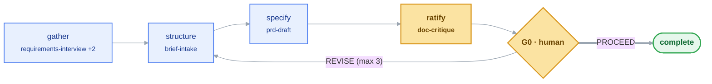
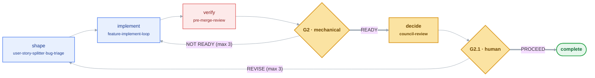
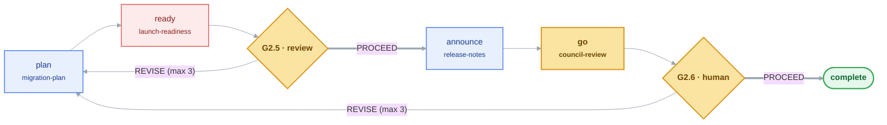
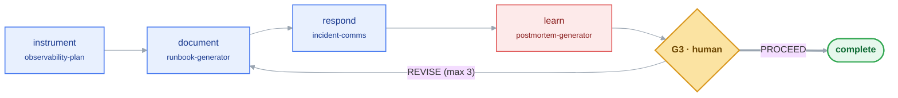
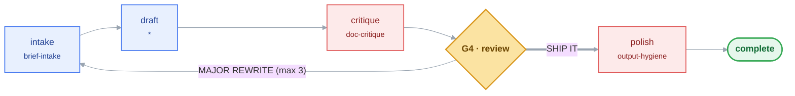

# The loops, stage by stage

Why loops exist and why there are five lifecycle loops is in [Why loops](../explanation/loops.md). This page is the reference: what each one takes and produces, and its stages.

skilldrop ships **loops**, not just parts. A loop is a named sequence of stages over existing skills with a gate between them: [`packs/<pack>/loops/<name>/LOOP.md`](../../packs) is what an agent reads, `loop.json` is the machine-readable contract ([RFC-0028](../../docs/rfcs/0028-loops-as-a-primitive.md)). **Nothing comes out of a loop until it passes that loop's gate.**

A loop *sequences* skills — it never contains one. Every skill stays independently installable and runnable on its own, which is what keeps a single-folder copy working in Cursor, Kiro, or Aider.

Five loops cover the lifecycle, and they are separated by **reversibility** — how expensive the mistake is to unwind — which is why each gets its own gate rather than folding into a neighbour:

| Loop | Takes | Gate | Produces | Mistake costs |
|---|---|---|---|---|
| [`discover`](../../packs/product-manager/loops/discover/LOOP.md) | interviews, journeys, a strategy question | **G0** human — a person ratifies the brief | a ratified requirement | a re-brief |
| [`design`](../../packs/solution-architect/loops/design/LOOP.md) | a ratified requirement | **G1** review — `council-review`'s panel | a recorded decision (ADR) | months, unwound in code |
| [`build`](../../packs/dev-team/loops/build/LOOP.md) | an agreed requirement or triaged defect | **G2** mechanical — `pre-merge-review`'s gate script decides | merged code | a revert |
| [`release`](../../packs/dev-team/loops/release/LOOP.md) | merged code | **G2.5** review — `launch-readiness` on evidence; **G2.6** human go/no-go | a live, reversible rollout | users and data, often irreversible |
| [`operate`](../../packs/sre-oncall/loops/operate/LOOP.md) | a shipped service | **G3** human — the incident is closed | a postmortem and runbook deltas | live users, irreversible |

Plus one **wrapper**, which is not a lifecycle stage but the two passes either side of *any* generator:

| Wrapper | Takes | Gate | Produces |
|---|---|---|---|
| [`ship-a-draft`](../../packs/core/loops/ship-a-draft/LOOP.md) | raw notes, a transcript, a ticket | **G4** review — `doc-critique`'s verdict | a stakeholder-ready artifact |

And one loop outside the delivery lifecycle, for a person and not a team:

| Loop | Takes | Gate | Produces | Mistake costs |
|---|---|---|---|---|
| [`apply`](../../packs/career/loops/apply/LOOP.md) | a job posting and a resume | **G5** human — the candidate decides to apply; **G6** human — the candidate confirms every line is true | a tailored resume and cover letter, ready to send | a claim the candidate cannot back at interview |

Every gate emits a verdict from one shared vocabulary ([`contracts/terminals.json`](../../contracts/terminals.json)) in five classes — pass, conditional, revise, redirect, blocked — so `READY`, `PROCEED` and `SHIP IT` are recognisably the same kind of answer. The diagrams below render on GitHub; their Mermaid sources live in [`docs/loops/`](../../docs/loops) for re-rendering.

*Diagrams below are generated from each loop's `loop.json` by [`build_loops.py`](../../build_loops.py) — edit the contract, not the picture.*

## `discover` — raw signal to a ratified requirement

Interviews, journeys and strategy questions become one tagged brief, then numbered requirements a **human ratifies** before any design starts.

<!-- loop:discover:start -->

<!-- loop:discover:end -->

## `design` — a requirement to a recorded decision

Constraints first, then structure and diagrams, then an attack, then a panel that must agree — and only then is the decision written down as an ADR.

```mermaid
%%{init: {'theme':'base','themeVariables':{'fontFamily':'Segoe UI, Helvetica, Arial','fontSize':'15px','lineColor':'#9AA5B1'},'flowchart':{'curve':'basis','rankSpacing':70,'nodeSpacing':50,'padding':16}}}%%
flowchart LR
    classDef gen    fill:#E8F0FE,stroke:#4C7DF0,stroke-width:1.5px,color:#1A3A8F;
    classDef review fill:#FDEAEA,stroke:#E05B5B,stroke-width:1.5px,color:#8A1F1F;
    classDef gate   fill:#FBE3A2,stroke:#D9971E,stroke-width:2px,color:#6B4500,font-weight:bold;
    classDef ship   fill:#E6F7EC,stroke:#34A853,stroke-width:2px,color:#0F6B33,font-weight:bold;

    constrain["constrain<br/><small>nfr-spec</small>"]:::gen
    shape["shape<br/><small>design-doc·architecture-diagrams</small>"]:::gen
    threat["threat<br/><small>threat-model</small>"]:::review
    ratify["ratify<br/><small>council-review</small>"]:::gate
    record["record<br/><small>adr-generator</small>"]:::gen
    G1{"G1 · review"}:::gate
    DONE(["complete"]):::ship

    constrain --> shape
    shape --> threat
    threat --> ratify
    ratify --> G1
    G1 == "PROCEED" ==> record
    record --> DONE

    G1 -- "REVISE (max 3)" --> shape
```

<!-- loop:design:start -->

<!-- loop:design:end -->

## `build` — a requirement to merged code

A vertical slice becomes shippable code through a self-correcting loop, gated by a script whose exit code decides. The inner generate-challenge cycle is the [`feature-implement-loop`](../../packs/dev-team/skills/feature-implement-loop/SKILL.md) skill.

<!-- loop:build:start -->

<!-- loop:build:end -->

## `release` — merged code to live users

Plan the rollout and the way back, judge readiness on evidence, draft the release notes, then a human makes the go/no-go call. The gap between a merge you can revert and a launch you often cannot.

<!-- loop:release:start -->

<!-- loop:release:end -->

## `operate` — a shipped service through detection and learning

Instrument, write the runbook, communicate the incident, then feed the postmortem's runbook deltas straight back into the runbook. The one loop whose failures are live.

<!-- loop:operate:start -->

<!-- loop:operate:end -->

## `ship-a-draft` — raw input to a stakeholder-ready artifact

The wrapper: structured intake before any generator, critique and a machine-residue scrub after. Loops back through intake — not the draft — until it's approved.

<!-- loop:ship-a-draft:start -->

<!-- loop:ship-a-draft:end -->

## `apply` — one posting and one resume to an application ready to send

An honest fit check first, and the candidate decides whether to apply before anything is written. Then a tailored resume and a cover letter that claim nothing the candidate didn't supply, which the **candidate confirms** line by line before sending.

```mermaid
%%{init: {'theme':'base','themeVariables':{'fontFamily':'Segoe UI, Helvetica, Arial','fontSize':'15px','lineColor':'#9AA5B1'},'flowchart':{'curve':'basis','rankSpacing':70,'nodeSpacing':50,'padding':16}}}%%
flowchart LR
    classDef gen    fill:#E8F0FE,stroke:#4C7DF0,stroke-width:1.5px,color:#1A3A8F;
    classDef review fill:#FDEAEA,stroke:#E05B5B,stroke-width:1.5px,color:#8A1F1F;
    classDef gate   fill:#FBE3A2,stroke:#D9971E,stroke-width:2px,color:#6B4500,font-weight:bold;
    classDef ship   fill:#E6F7EC,stroke:#34A853,stroke-width:2px,color:#0F6B33,font-weight:bold;

    fit["fit<br/><small>job-fit-analysis</small>"]:::gate
    tailor["tailor<br/><small>resume-tailor</small>"]:::gen
    letter["letter<br/><small>cover-letter</small>"]:::gen
    form["form<br/><small>application-form-answers</small>"]:::gen
    confirm["confirm<br/><small>output-hygiene</small>"]:::review
    G5{"G5 · human"}:::gate
    G6{"G6 · human"}:::gate
    DONE(["complete"]):::ship

    fit --> G5
    G5 == "PROCEED" ==> tailor
    tailor --> letter
    letter --> form
    form --> confirm
    confirm --> G6
    G6 == "READY" ==> DONE

    G6 -- "NOT READY (max 3)" --> tailor
```

<!-- loop:apply:start -->

<!-- loop:apply:end -->
