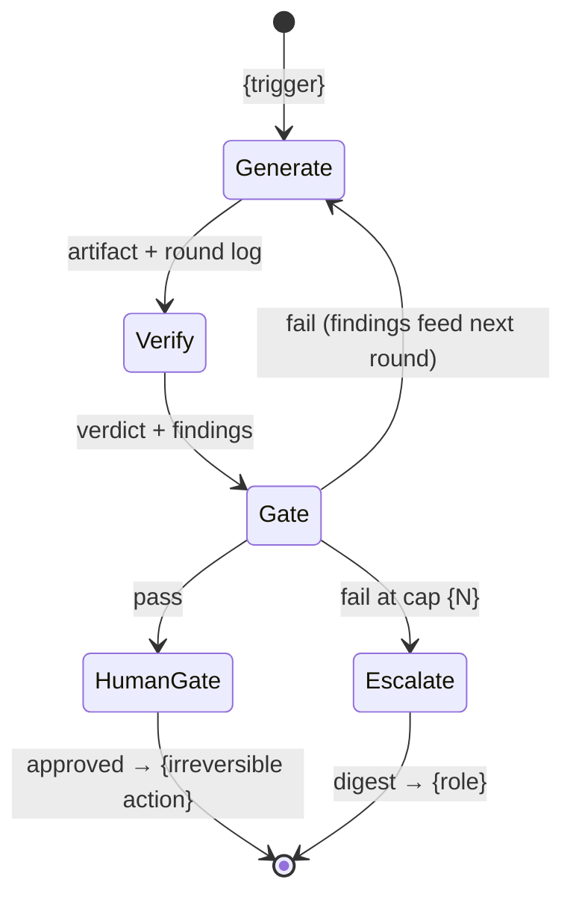

# Loop spec: {loop name — the task, not the tech}

> One run produces: {artifact} · Done when: {observable condition} · Owner: {role}

## State machine

## Caps

| Cap | Value | Rationale |
|---|---|---|
| Revision cap | {N, default 3} | {what could later rounds know that round 3 didn't?} |
| Budget per run | {tokens or currency; cite the `agent-budget` line, or a stated number tagged [assumption] until that spec exists} | {…} |

## Verification (never the generator)

- Verifier: {persona/prompt/program, and why it's independent of the generator}
- Judges against: {the done-condition, itemized}
- Cheapest adequate check: {programmatic where possible → structured assertions → LLM judge last}

## Human gates

| Gate | Guards (irreversible action) | Digest the human sees |
|---|---|---|
| {name} | {merge / send / deploy / delete} | {artifact + verdict + delta since last gate} |

## Failure routes

- **Cap hit** → {role} with digest: rounds used, last findings, attempt diffs
- **Verifier can't judge** → `BLOCKED: {what's missing}` to {destination}
- **Systemic** (same finding class twice) → stop early, route to {role}

## Telemetry (per run)

rounds-used · spend · verdict · escalated? — reviewed {cadence} by {role}; alert when rounds-to-pass trends up {threshold}.
