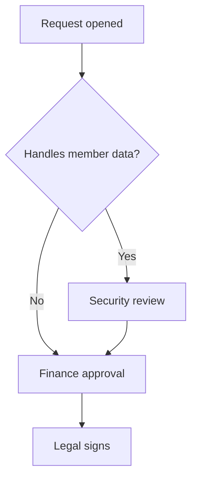

# Vendor onboarding policy

Northwind Health onboards a vendor only after the checks below are complete.[^1]

## Scope

This policy covers every supplier paid more than $1,000 in a year, including software subscriptions.

## Approval process

1. The requester opens a vendor request.
   1. Attach the quote.
   2. Name the budget owner.
2. Security reviews the vendor questionnaire.
   1. A vendor that handles member data needs a SOC 2 Type II report.
3. Finance approves within the limits below.
4. Legal signs the contract.

## Approval limits

| Role | Limit | Second approver |
|:-----|------:|:----------------|
| Team lead | $5,000 | none |
| Director | $50,000 | Finance partner |
| CFO | unlimited | CEO above $500,000 |

## Approval path

## Exceptions

An emergency purchase under $5,000 may be approved after the fact within **five working days**.

[^1]: Finance policy FIN-012, section 4.
