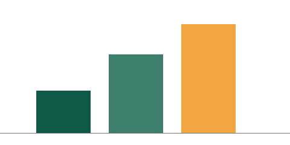

# Northwind Support: Q3 review

Prepared for the **Acme account team**. This review covers July to September and the
*three* changes we propose for Q4. Raw numbers live in the [support dashboard](https://dashboard.northwind.example/support).

## Summary

- First-response time fell from 6.1 to 3.4 hours
- Backlog is down 18%, mostly in the EMEA queue
  - EMEA: 412 → 301 open tickets
  - APAC: unchanged at 155
- [x] Chatbot hand-off rule shipped in August
- [ ] Weekend rota still not agreed

## Tickets by region

| Region | Opened | Closed | Median first response |
|:-------|-------:|-------:|:---------------------:|
| EMEA   | 2,140  | 2,251  | 3.1 h                 |
| NA     | 1,876  | 1,840  | 3.6 h                 |
| APAC   | 932    | 932    | 3.9 h                 |



## Proposals for Q4

1. Agree the weekend rota by 15 October.
2. Move APAC triage into the shared queue.
3. Retire the legacy `support@` alias; see [the alias section](#retiring-the-alias).

> Customers said the chatbot hand-off was the biggest improvement this year.
> — from the September survey[^1]

### Retiring the alias

The forwarding rule to remove:

```text
match: to == "support@northwind.example"
action: forward -> queue/general
```

<div class="callout">Draft — not yet reviewed by Legal.</div>

---

Questions go to the support ops channel.

[^1]: 214 responses, 31% response rate.
