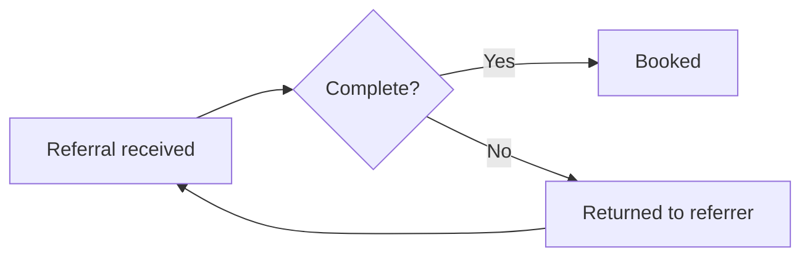

# Northwind Health operations review, Q3

Prepared for the ops committee. Figures cover 1 July to 30 September.

## Summary

Appointment wait time fell and the no-show rate held steady. The call centre missed its answer-time target in August.

## Results

| Measure | Q2 | Q3 | Target |
|:--------|---:|---:|-------:|
| Median wait for an appointment (days) | 9 | 6 | 7 |
| No-show rate | 8.4% | 8.1% | 8.0% |
| Calls answered within 60 seconds | 82% | 76% | 80% |
| Member satisfaction (out of 5) | 4.2 | 4.4 | 4.3 |

## Dashboard

## How a referral moves

## Next quarter

- Add two call-centre shifts on Mondays.
- Pilot text reminders at the Riverside clinic.
