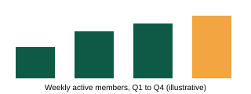
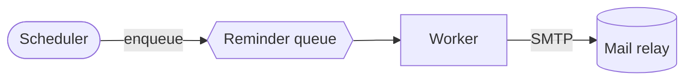

# Northwind Health: Q3 platform review

Prepared for the **operations committee**. Figures are *placeholders* for this example.

## Summary

- Uptime held at the target for the quarter
- Two incidents, both under 30 minutes
  - INC-101: login latency
  - INC-102: delayed reminder emails
- [x] Migrate reminders to the new queue
- [ ] Retire the old scheduler

> Decision needed: approve the scheduler retirement for October.

## Numbers

| Metric | Q2 | Q3 | Change |
|:-------|---:|---:|:------:|
| Uptime | 99.90% | 99.95% | up |
| Incidents | 4 | 2 | down |
| `p95` login (ms) | 410 | 380 | down |



## How a reminder is sent



The worker retries with this rule:

```python
def backoff(attempt):
    return min(2 ** attempt, 300)  # seconds, capped at 5 minutes
```

## Notes

Raw HTML is shown as text, not run: <script>alert("hi")</script>

<div style="color:red">This block came from a pasted email.</div>

See the [runbook](https://northwindhealth.example/runbooks/reminders) for the retry rules.
