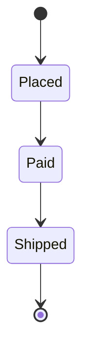

# Contoso orders

## Order states



## Order flow

```mermaid
flowchart TD
    A[Customer places order] --> B{In stock?}
    B -->|Yes| C[Reserve stock (warehouse)]
    B -->|No| D[Back-order]
    C -> E[Take payment]
    E --> F[Ship]
    D --> F
```
