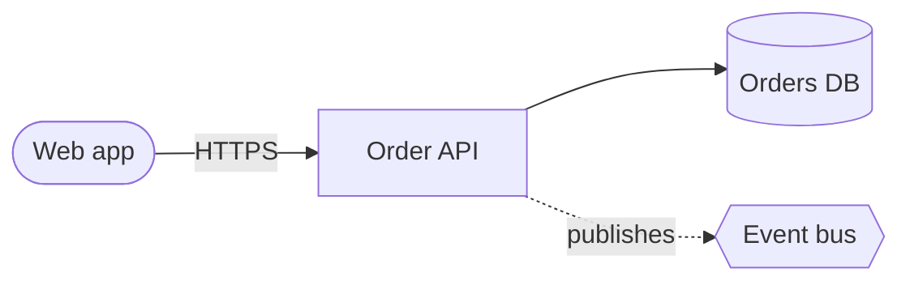
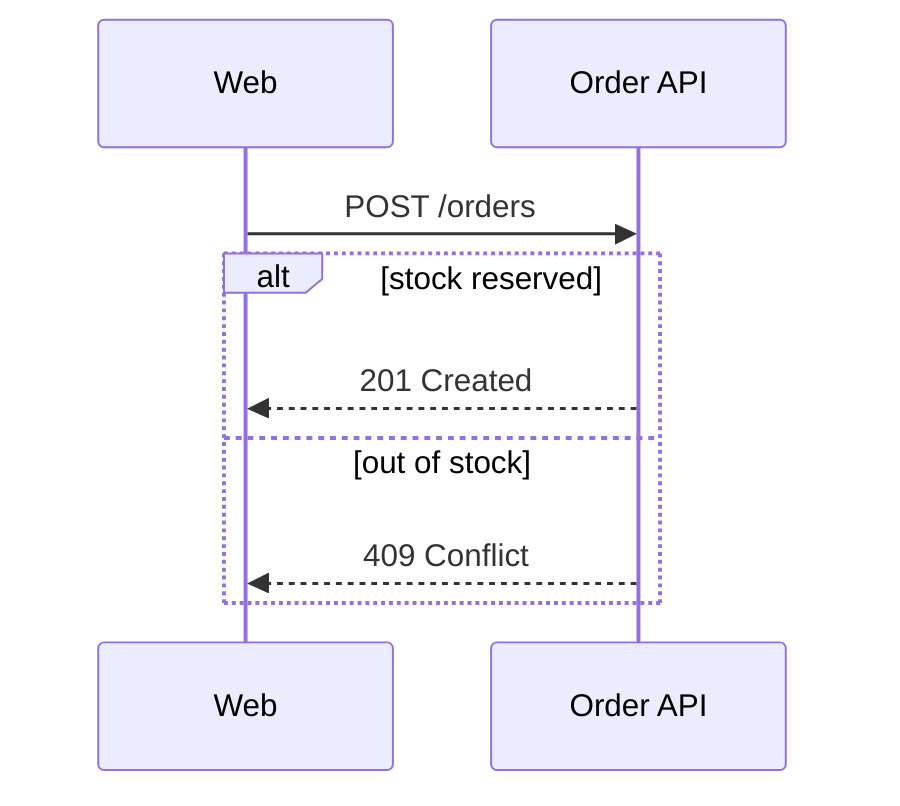

# Contoso order service: design notes

The request path:



What happens on checkout:



The order lifecycle (has a mistake):

```mermaid
stateDiagram-v2
    [*] --> Placed
    state Fulfilment {
        Placed --> Packed
        Packed --> Shipped
    [*] --> Cancelled
```
