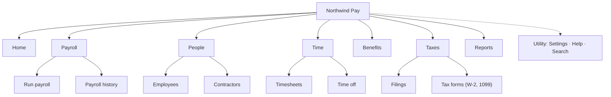

# Worked example — a cluttered payroll app menu, restructured around tasks

## Input given to the skill

> Our payroll app for small businesses (Northwind Pay) has a left menu that's grown to 14 items and
> customers keep raising tickets asking where things are. Current menu: Dashboard, Run Payroll,
> Employees, Contractors, Time Tracking, PTO, Reports, Tax Filings, Tax Forms, Benefits, Integrations,
> Company Settings, Billing, Help. Most tickets are "where do I download W-2s" and "how do I add a
> contractor". Users are business owners and office managers, usually not accountants.

## Output

# Information architecture: Northwind Pay

**Status:** hypothesis, not yet validated · **Evidence level:** [assumption-based], with two ticket themes from the user
**Assumptions to confirm first:** owners and office managers share one navigation (no separate admin area); contractors are paid through the same payroll run.

### Audiences and top tasks

| Audience | Top tasks (ranked) |
|---|---|
| Business owner / office manager | 1. Run payroll 2. Add or change a person 3. Get tax forms for employees [support tickets] 4. Approve time off |

### Content inventory

| # | Item | Type | Status | Notes |
|---|---|---|---|---|
| 1 | Dashboard | task | keep, rename "Home" | landing page |
| 2 | Run Payroll | task | keep | top task |
| 3 | Employees | object | merge with 4 into "People" | |
| 4 | Contractors | object | merge into 3 | "add a contractor" ticket theme |
| 5 | Time Tracking | task | keep, under "Time" | |
| 6 | PTO | task | merge into "Time" | |
| 7 | Reports | reference | keep | |
| 8 | Tax Filings | task | merge with 9 into "Taxes" | |
| 9 | Tax Forms | reference | merge into 8 | "download W-2s" ticket theme |
| 10 | Benefits | task | keep | |
| 11 | Integrations | account | move to utility (Settings) | set up once |
| 12 | Company Settings | account | move to utility | |
| 13 | Billing | account | move to utility | |
| 14 | Help | utility | move to utility | |

### Organising scheme

- **Level 1:** task, with "People" and "Taxes" as objects users already name that way. Mixed on purpose: owners say "add someone to People" and "get my tax forms", so those words beat a verb phrase.
- **Level 2:** object (the records inside each area).

### Sitemap

```
Northwind Pay
├── Home
├── Payroll
│   ├── Run payroll
│   └── Payroll history
├── People
│   ├── Employees
│   └── Contractors
├── Time
│   ├── Timesheets
│   └── Time off
├── Benefits
├── Taxes
│   ├── Filings
│   └── Tax forms (W-2, 1099)
├── Reports
└── [Utility] Settings (Company · Integrations · Billing) · Help · Search
```



Global nav: 7 items (Home, Payroll, People, Time, Benefits, Taxes, Reports). Utility: 3.

### Label rationale

| Label | Holds | Why this word | Rejected | Evidence |
|---|---|---|---|---|
| People | employees and contractors | one place to "add someone", whatever their type | Team, Workforce | [support tickets] "add a contractor" |
| Taxes | filings and forms | users search for the form, not the filing process | Compliance, Tax Center | [support tickets] "download W-2s" |
| Time | timesheets, time off | covers both without jargon | PTO (acronym), Attendance | [assumption] |
| Tax forms (W-2, 1099) | year-end forms | names the forms users ask for | Documents | [support tickets] |

### Findability risks

| Severity | Item | Why users will look elsewhere | Mitigation |
|---|---|---|---|
| 🟥 | Tax forms | Users may look under People (forms are per employee) or Reports | Cross-link from each employee record and from Reports; add "W-2" and "1099" as search synonyms |
| 🟧 | Contractors | Some owners don't think of contractors as "People" | Show "Add employee or contractor" as one button on People |
| 🟨 | Integrations | Moved out of global nav; rare but needed at setup | Link it from the Home setup checklist |

### Validation plan

**Method:** tree test of the sitemap above against the current menu · **Participants:** owners and office managers, unmoderated · **Threshold:** 70% success and 80% correct first click per task, set before running

| # | Task (no label words) | Correct destination | Tests risk |
|---|---|---|---|
| 1 | Your employee asks for last year's form to file her personal return. Where do you get it? | Taxes › Tax forms | 🟥 Tax forms |
| 2 | You've hired a freelance designer for three months. Where do you set them up to be paid? | People › Contractors | 🟧 Contractors |
| 3 | An employee wants next Friday off. Where do you approve it? | Time › Time off | |
| 4 | You want to connect your accounting software. | Settings › Integrations | 🟨 Integrations |
| 5 | You need to check what you paid everyone last month. | Payroll › Payroll history | |
| 6 | Your card on file has expired. | Settings › Billing | |

**What changes the design:** task 1 below threshold with most first clicks on People → move Tax forms under People and keep a Taxes cross-link. Task 2 below threshold → split People back into Employees and Contractors.

### Hand-offs

- The Taxes landing page content → `content-design`
- Menu labels, the "Add employee or contractor" button and empty states → `ux-writing`
