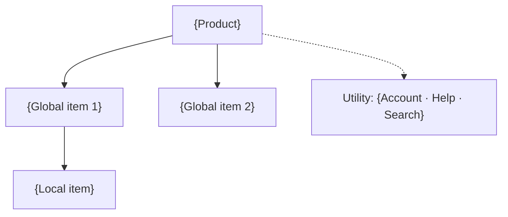

# Information architecture: {product or site}

**Status:** hypothesis, not yet validated · **Evidence level:** {[observational] / [analytics] / [assumption-based]}
**Assumptions to confirm first:** {list, or "none"}

## Audiences and top tasks

| Audience | Top tasks (ranked) |
|---|---|
| {audience} | 1. {task} 2. {task} 3. {task} |

## Content inventory

| # | Item | Type | Audience | Status | Notes |
|---|---|---|---|---|---|
| 1 | {item} | {task / reference / account / legal / marketing} | {audience} | {keep / merge into # / cut / [inferred]} | {} |

## Organising scheme

- **Level 1:** {task / topic / audience / object} — {why}
- **Level 2:** {scheme} — {why}

## Sitemap

```
{Product}
├── {Global item 1}
│   ├── {Local item}
│   └── {Local item}
├── {Global item 2}
└── [Utility] {Account · Help · Search}
```



## Navigation model

| System | Items | Where it appears |
|---|---|---|
| Global | {5–7 items} | Every page |
| Local | {per global area} | {sidebar / tabs} |
| Utility | {account, settings, help, search} | {header right / avatar menu} |
| Cross-links | {item → also linked from} | {} |
| Search | {role, synonyms to add} | {} |

## Label rationale

| Label | Holds | Why this word | Rejected alternatives | Evidence |
|---|---|---|---|---|
| {label} | {} | {} | {} | {[search logs] / [support tickets] / [interview] / [assumption]} |

## Findability risks

| Severity | Item | Why users will look elsewhere | Mitigation |
|---|---|---|---|
| 🟥 / 🟧 / 🟨 | {} | {} | {} |

## Validation plan

**Method:** {open / hybrid card sort, tree test} · **Participants:** {n per audience} · **Threshold:** {success %, first-click %}

| # | Task (no label words) | Correct destination | Tests risk |
|---|---|---|---|
| 1 | {} | {} | {} |

**What changes the design:** {result → action}

## Hand-offs

- {Key page} → `content-design`
- Nav and button strings → `ux-writing`
