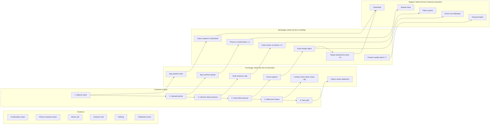

# Worked example — a home-insurance claim, from burst pipe to payment

## Input given to the skill

> We did a journey map for Northwind Insurance's home claims. The two worst moments were "uploads
> photos, then gets asked for the same photos again by phone" and "waits with no update after the
> assessor visit". Can you blueprint what happens behind that? What we know: customers report on
> the app or by phone to the contact centre. Claims go into ClaimDesk (our claims system). A desk
> assessor reviews the claim and decides whether to send a field assessor; field assessors are a
> third-party firm, Acme Loss Adjusting, who email their report back. Photos uploaded in the app
> land in a shared inbox, not in ClaimDesk. Payment goes through the finance team in a weekly batch.
> Our SLA is to contact the customer within 2 working days of the claim.

## Output

# Service blueprint: home-insurance customer claims for a burst pipe, from reporting it to being paid

**Evidence level:** [documented], from the team's description and the journey map. Durations without an SLA are `[estimate]`.
**Built on:** Northwind home claims journey map (the two pains above).
**Variants not shown:** claim declined; emergency repair needed first; customer reports by phone (it differs at steps 1–2 only).
**Assumptions to confirm first:** desk assessors work only in ClaimDesk and don't watch the shared inbox; Acme's report arrives as a PDF attached to an email.

### Blueprint

| Lane | 1. Reports the claim | 2. Uploads photos | 3. Gets a call from the desk assessor | 4. Hosts the field assessor | 5. Waits for a decision | 6. Gets paid |
|---|---|---|---|---|---|---|
| **Evidence** | App claim form, confirmation email with claim number | "Photos received" screen | Phone call | Assessor visit, business card | Nothing | Settlement email, bank credit |
| **Customer actions** | Fills in the claim form in the app | Uploads 6–10 photos | Answers questions, is asked for photos again | Shows the damage | Chases by phone | Checks the amount |
| *— line of interaction —* | | | | | | |
| **Frontstage** (owner) | App submits the claim (digital team) | App confirms upload (digital team) | Calls the customer (desk assessor) | Inspects and measures (Acme field assessor) | Takes the chase call, can't see status (contact centre) | Sends settlement email (claims) |
| *— line of visibility —* | | | | | | |
| **Backstage** (owner) | Claim created in ClaimDesk (automated) | Photos go to the shared inbox (no owner) | Reviews the claim in ClaimDesk, can't see photos, decides on field visit (desk assessor) | Writes the report, emails it to the shared inbox (Acme) | Report waits in the inbox, then is attached by hand to ClaimDesk; desk assessor decides (desk assessor, claims admin) | Approves payment and adds it to the weekly batch (finance) |
| *— line of internal interaction —* | | | | | | |
| **Support processes** | ClaimDesk | Shared email inbox | ClaimDesk, policy system | Acme Loss Adjusting | Shared email inbox, ClaimDesk | Weekly payment batch |
| **Fail points / waits** | | ⚠1 photos not linked to the claim | ⏱2 up to 2 working days (SLA) · ⚠3 asks for photos again | ⏱4 visit booking `[estimate]` 3–5 days | ⏱5 report to decision `[estimate]` 5–10 days · ⚠6 report sits unseen | ⏱7 up to 7 days for the batch |

### Diagram

### Fail points and waits

| # | Step | Type | What happens | Customer effect | Frequency / duration | Handoff? |
|---|---|---|---|---|---|---|
| 1 | 2 | ⚠ fail | Photos land in a shared inbox, not on the claim | Their upload goes nowhere useful | Every app claim `[assumption]` | App → inbox (no owner) |
| 2 | 3 | ⏱ wait | Time to first contact | Doesn't know if the claim was received by a person | Up to 2 working days (SLA) | ClaimDesk → desk assessor |
| 3 | 3 | ⚠ fail | Desk assessor can't see the photos and asks for them again | Journey-map pain 1 | Every app claim `[assumption]` | |
| 4 | 4 | ⏱ wait | Booking the field visit | Waits with damage unrepaired | 3–5 days `[estimate]` | Desk assessor → Acme |
| 5 | 5 | ⏱ wait | Report to decision | Journey-map pain 2: no update | 5–10 days `[estimate]` | Acme → inbox → claims admin → desk assessor |
| 6 | 5 | ⚠ fail | Report sits in the shared inbox until someone attaches it | Longer wait, chase calls | Unknown | Acme → inbox (no owner) |
| 7 | 6 | ⏱ wait | Approved payment waits for the weekly batch | Paid up to a week after approval | Up to 7 days | Claims → finance |

### Pain → cause

| Customer pain (journey map) | Cause (lane, step) |
|---|---|
| Asked for the same photos again | Backstage 2: uploads go to an unowned shared inbox; backstage 3: desk assessor works only in ClaimDesk |
| No update after the assessor visit | Backstage 5: Acme's report goes to the same inbox and waits to be attached by hand; frontstage 5: contact centre can't see status, so chase calls go nowhere |

### Ranked fixes

| Rank | Fix (outcome) | Lane it changes | Owner | Addresses |
|---|---|---|---|---|
| 1 | Photos uploaded in the app appear on the claim in ClaimDesk, with no inbox step | Backstage, support | Digital team with claims | ⚠1, ⚠3 |
| 2 | Acme's report reaches the claim directly, and the customer is told when it has arrived and when to expect a decision | Backstage, frontstage | Claims, with Acme | ⚠6, ⏱5 |
| 3 | The contact centre can see claim status, so a chase call ends with an answer | Frontstage | Contact centre | ⏱5 |

**Not prioritised now:** ⏱7 weekly payment batch (a finance process change with wider impact; revisit after fixes 1–2); ⏱2 first-contact SLA (met today, and fix 1 makes the first call shorter).

### Open questions

- How many claims a month arrive through the app vs by phone? This sizes fix 1.
- What does Acme's contract say about report turnaround? It may already have an SLA nobody tracks.
- Who owns the shared inbox today? The blueprint found no owner.

**Hand-offs:** fix 1 becomes committed work → `prd-draft`. The ClaimDesk integration design → `architecture-diagrams`.
