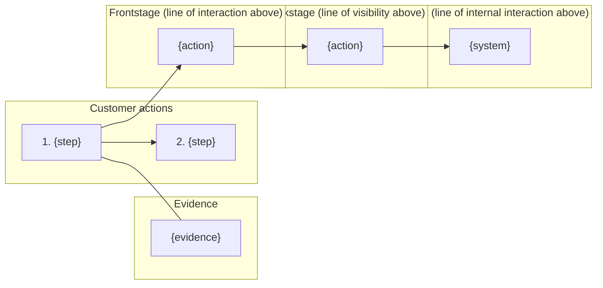

# Service blueprint: {customer type} {does what}, from {trigger} to {end state}

**Evidence level:** {[observed] / [documented] / [assumption-based]} · **Built on:** {user-journey-map title, or "no journey map"}
**Variants not shown:** {list} · **Assumptions to confirm first:** {list, or "none"}

## Blueprint

| Lane | 1. {step} | 2. {step} | 3. {step} |
|---|---|---|---|
| **Evidence** | {} | {} | {} |
| **Customer actions** | {} | {} | {} |
| *— line of interaction —* | | | |
| **Frontstage** (owner) | {action} ({role}) | | |
| *— line of visibility —* | | | |
| **Backstage** (owner) | {action} ({team}) | | |
| *— line of internal interaction —* | | | |
| **Support processes** | {system / third party} | | |
| **Fail points / waits** | ⚠ {} · ⏱ {duration} | | |

## Diagram

## Fail points and waits

| # | Step | Type | What happens | Customer effect | Frequency / duration | Handoff? |
|---|---|---|---|---|---|---|
| 1 | {} | ⚠ fail / ⏱ wait | {} | {} | {measured / SLA / [estimate]} | {team → team} |

## Pain → cause

| Customer pain | Cause (lane, step) |
|---|---|
| {} | {} |

## Ranked fixes

| Rank | Fix (outcome) | Lane it changes | Owner | Addresses |
|---|---|---|---|---|
| 1 | {} | {} | {} | {#} |

**Not prioritised now:** {list}

## Open questions

- {}
