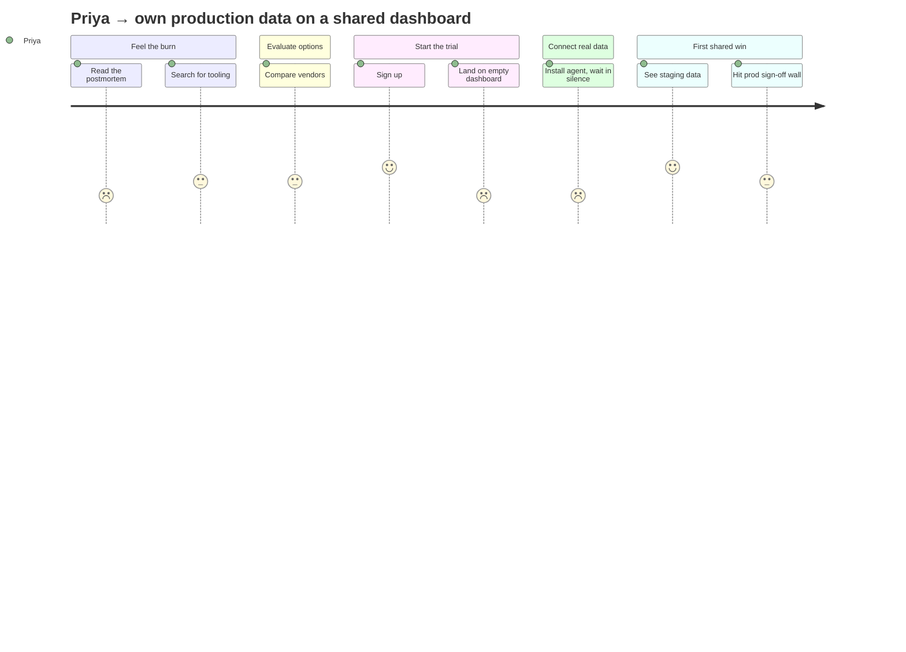

# Worked example: trial-to-activation journey for a B2B monitoring SaaS

**Input given to the skill:**

> Map the journey for engineering managers trialing our infrastructure-monitoring product. We think most trials stall before the first dashboard shows real data. No user research yet — this is what the growth team believes is happening. Trial starts when an alerting incident burns the team; success is the manager seeing their own production data on a dashboard and sharing it with the team.

**Output:**

---

# Journey map: Engineering manager "Priya" → own production data on a shared dashboard

> Evidence level: `[assumption-based]` — growth-team hypothesis, no primary research yet. This map directs research; treat pains as hypotheses to verify, not findings.
> Start trigger: a production incident goes unnoticed for 40 minutes and the postmortem lands on Priya's desk · End state: Priya shares a dashboard of her own production data with her team

## Stages

| | Feel the burn | Evaluate options | Start the trial | Connect real data | First shared win |
|---|---|---|---|---|---|
| **Actions** | Reads the postmortem; asks "why didn't we see this?"; searches "kubernetes monitoring alerts" | Skims 3 vendor sites; asks peers in a Slack community; shortlists 2 | Signs up with work email; lands on an empty dashboard | Installs the agent on a staging cluster; hunts for the right Helm values; waits for data | Sees staging metrics; wants prod but needs security sign-off; shares a screenshot in team channel |
| **Emotion (1–5 + why)** | 2 — on the hook for an outage nobody saw | 3 — options exist, but every site says the same words | 4 — signup was fast, feels like progress | 2 — empty dashboard + config hunt; unclear if it's working or broken | 3 — win is real but staging-only; prod approval looms |
| **Pains** | Postmortem pressure with no tooling answer | Undifferentiated marketing; can't tell depth from demos | **Empty dashboard with no next step** | **No feedback during agent setup — silence until data arrives**; Helm docs assume expertise | Security review blocks prod; sharing is screenshot-only |
| **Opportunities** | Meet the searcher with the incident story, not a feature tour | Let Priya see the product on realistic data before signup | First session ends with data visible, even if sample | Setup progress is visible minute-by-minute; failure states name their fix | The shared artifact is live, not a screenshot; security answers are self-serve |

## Emotion arc

## Peaks and ending

- **Steepest dips:** signup-high (4) → empty dashboard (2) — the sharpest single drop in the journey; agent install silence (2) — longest time spent at the bottom
- **Highest peak:** staging data appears (4)
- **Ending emotion:** 3 — a real win immediately blunted by the prod-approval wall; the journey *ends* on friction, which the peak-end rule says colors the whole trial

## Opportunities, ranked

| # | Opportunity (outcome-shaped) | Dip severity | Reach | Evidence | Target? |
|---|---|---|---|---|---|
| 1 | The first session ends with data on the dashboard, even sample data | 4→2, sharpest drop | every trial | `[assumption-based]` | ✅ named target |
| 2 | Setup progress is visible minute-by-minute; silence never means "unknown" | 2, longest dwell | every self-serve install | `[assumption-based]` | ✅ named target |
| 3 | Security answers are self-serve so prod approval starts during trial | ending friction | enterprise segment | `[assumption-based]` | deprioritized — smaller reach; revisit after research |
| 4 | Evaluation shows the product on realistic data pre-signup | 3, mild | top of funnel | `[assumption-based]` | deprioritized — funnel, not activation |

## Hand-off

- Target #1 → verify with session recordings first (`[assumption-based]` — 5 recordings would confirm the drop), then `prd-draft` for the empty-state experience
- Target #2 → `user-story-splitter` (install-feedback states are already story-shaped)
- Fix measurement → `success-metrics`: candidate first-success event is "real data visible in first session"
- Backstage causes implicated: agent packaging (Helm defaults), security-review process → platform team, security team

---

**Why this output passes the quality bar:** one persona, one outcome, both in the title; evidence level declared and repeated where it matters (the map admits it's a hypothesis and names the research that would confirm it); stage edges live in Priya's life (the postmortem, not the landing page); every emotion score has a reason; opportunities are outcomes ("first session ends with data"), not features ("add sample data mode"); dips, peak, and ending are marked; exactly two targets are named and the rest explicitly deprioritized.
