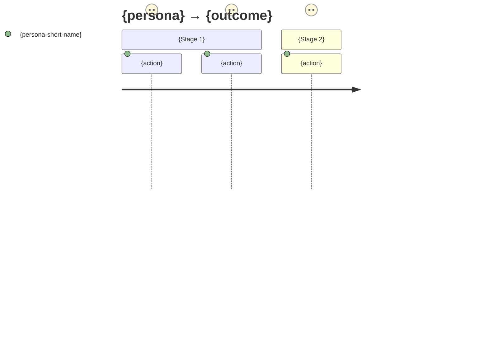

# Journey map: {persona} → {outcome}

> Evidence level: `[observational]` / `[survey/analytics]` / `[assumption-based]`
> Start trigger: {event in the persona's life} · End state: {what done means to the persona}

## Stages

<!-- 3–6 stages — add or remove columns to match the journey; four here is a placeholder, not a required count. -->

| | {Stage 1} | {Stage 2} | {Stage 3} | {Stage 4} |
|---|---|---|---|---|
| **Actions** | {what the persona does, their words} | | | |
| **Emotion (1–5 + why)** | {3 — reason} | | | |
| **Pains** | {friction; tag if evidence differs} | | | |
| **Opportunities** | {outcome, not feature} | | | |

## Emotion arc

## Peaks and ending

- **Steepest dips:** {stage/action, score, reason} · {stage/action, score, reason}
- **Highest peak:** {stage/action, score, reason}
- **Ending emotion:** {score, reason — peak-end rule counts this double}

## Opportunities, ranked

| # | Opportunity (outcome-shaped) | Dip severity | Reach | Evidence | Target? |
|---|---|---|---|---|---|
| 1 | {…} | {…} | {…} | {tag} | ✅ named target |
| 2 | {…} | {…} | {…} | {tag} | ✅ named target |
| 3 | {…} | {…} | {…} | {tag} | deprioritized — {why} |

## Hand-off

- Target #1 → `prd-draft` / `user-story-splitter` when committed
- Fix measurement → `success-metrics`
- Backstage causes implicated: {named systems/teams} → service owner
